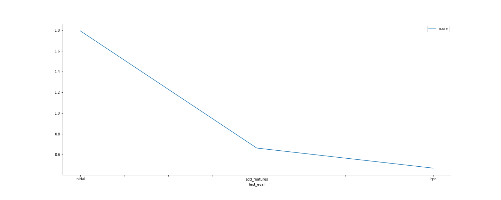

# Report: Predict Bike Sharing Demand with AutoGluon Solution
#### Jaloliddin Erkinov

## Initial Training
### What did you realize when you tried to submit your predictions? What changes were needed to the output of the predictor to submit your results?
TODO: Predicted negative count values are needed to be set to zero

### What was the top ranked model that performed?
TODO: Optimized WeightedEnsemble_L3 with hyperparameters

## Exploratory data analysis and feature creation
### What did the exploratory analysis find and how did you add additional features?
TODO: Datetime feature splitted into month, day and hour features
    Data type of features such as "weather" and "season" were changed to category

### How much better did your model preform after adding additional features and why do you think that is?
TODO: It became more than 2 times better (according to kaggle score) , as adding relevant features will help the model to make more accurate predictions

## Hyper parameter tuning
### How much better did your model preform after trying different hyper parameters?
TODO: Around 20-25% improvement was seen (according to kaggle score)

### If you were given more time with this dataset, where do you think you would spend more time?
TODO: I would spend more time on hyperparameter tuning, set TabularPredictor time_limit more than 600 secs, so that it can train more models which can result in better solution (score)

### Create a table with the models you ran, the hyperparameters modified, and the kaggle score.
|model|hpo1|hpo2|hpo3|score|
|--|--|--|--|--|
|initial|default|default|default|1.79380|
|add_features|default|default|default|0.66347|
|hpo|num_boost_round, num_leaves|CAT, RF, XT|scheduler, searcher, num_trials|0.46979|

### Create a line plot showing the top model score for the three (or more) training runs during the project.

TODO: Top Model:

### Create a line plot showing the top kaggle score for the three (or more) prediction submissions during the project.

TODO: Top Kaggle Score:

## Summary
TODO: In this project, Bike Sharing Demand has been explored by following steps of ML Lifecycle:
    Problem has been learned
    Data has been obtained from Kaggle competition "Bike Sharing Demand"
    The data has been described, visualized, analyzed, modified
    Model has been build using AutoGluon AutoML library in 3 different conditions (initial: with default parameters before data's been modified; add_features: with default parameters after data's been modified by adding new features; hpo: used tuning by applying additional hyperparameters)
    The model has been tested by submitting predictions to Kaggle
    
